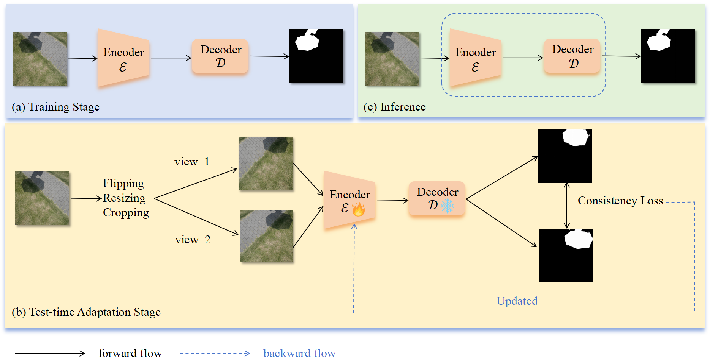

# :star:TICA

<b><a href='https://arxiv.org/pdf/2410.07695'>Test-Time Intensity Consistency Adaptation for Shadow Detection.</a> </b>

Leyi Zhu</a> 👨‍💻‍ 
,
  
    <a href='https://github.com/NiFangBaAGe'> Weihuang Liu</a>‍ 👨‍💻‍ 
  ,
    
   Xinyi Chen</a>‍ 
  ,
    
      Zimeng Li</a>‍ 
  ,
    
      <a href='https://cxh.netlify.app/'> Xuhang Chen</a>‍ 
  ,
  
   Zhen Wang</a> 
   and
  
  <a href="https://cmpun.github.io/" >Chi-Man Pun</a> 📮

  (👨‍💻‍ Equal contributions, 📮 Corresponding )

<b>University of Macau</b>

In <b>_International Conference on Neural Information Processing 2024 (ICONIP 2024)_</b>

# 📋 Abstract
Shadow detection is crucial for accurate scene understanding in computer vision, yet it is challenged by the diverse appearances of shadows caused by variations in illumination, object geometry, and scene context. Deep learning models often struggle to generalize to realworld images due to the limited size and diversity of training datasets. To address this, we introduce TICA, a novel framework that leverages lightintensity information during test-time adaptation to enhance shadow detection accuracy. TICA exploits the inherent inconsistencies in light intensity across shadow regions to guide the model toward a more consistent prediction. A basic encoder-decoder model is initially trained on a labeled dataset for shadow detection. Then, during the testing phase, the network is adjusted for each test sample by enforcing consistent intensity predictions between two augmented input image versions. This consistency training specifically targets both foreground and background intersection regions to identify shadow regions within images accurately for robust adaptation. Extensive evaluations on the ISTD and SBU shadow detection datasets reveal that TICA significantly demonstrates that TICA outperforms existing state-of-the-art methods, achieving superior results in balanced error rate (BER).

# 🔮 Overview 

  

**Overview of the proposed TICA.** By leveraging light consistency training, the TICA framework enhances the model’s capabilities in shadow detection. Initially, the model is trained with a publicly accessible shadow detection dataset. We then apply random data augmentation techniques—horizontal flipping, resizing, and cropping—to the test set. This facilitates model refinement by enforcing consistent intensity predictions between the two augmented images. The consistency loss is backpropagated to update the encoder.
